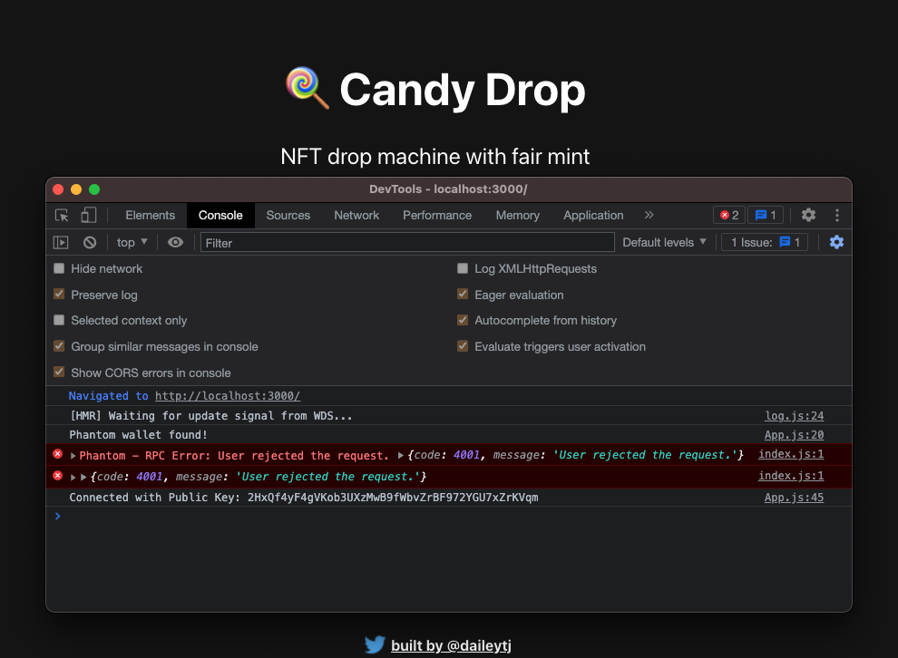

## Section_1

### Lesson 1

### Lesson 2

---

## Section_2

### Lesson 1

### Lesson 2

### Lesson 3

[First Randobot Uploaded to Arweave](https://arweave.net/pKjn35Nm7QAFO5rtLlSZXTom5xD91Dyth31_QPAdxbs)

### Lesson 4

[Candy Machine Deployment On Solana Explorer](https://explorer.solana.com/address/6bsEKqiQEjJWjhX2xfVkcenBM79oEyw737bSDAaDEyoV?cluster=devnet)

---

## Section_3

### Lesson 1

### Lesson 2

